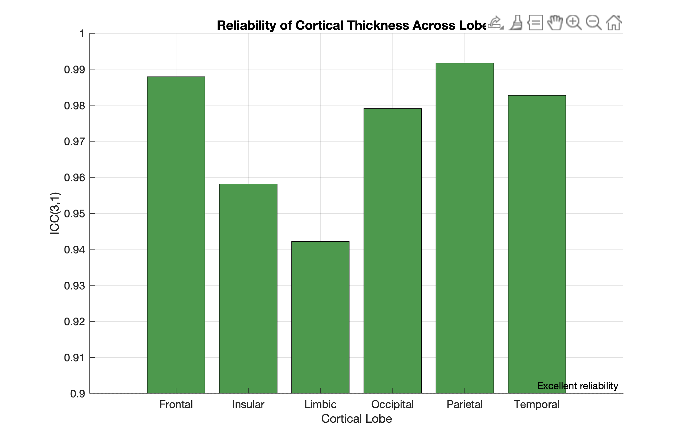
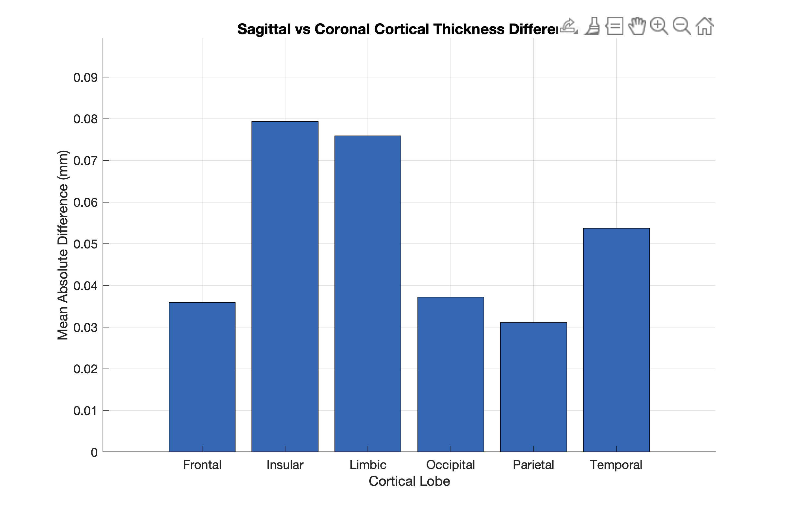

# Cortical Thickness Analysis using CAT12 for Orientation Reliability Assessment

This project evaluates the orientation robustness of CAT12-based cortical thickness estimation by comparing axial, sagittal, and coronal MRI acquisitions using quantitative reliability metrics (ICC, MAD). 

## Objectives
- Perform CAT12-based cortical thickness estimation
- Compare orientation-dependent differences
- Evaluate reliability across brain lobes
- Validate measurements using statistical analysis

## Processing Pipeline

1. MRI preprocessing using CAT12 GUI (SPM12)
2. Tissue segmentation and surface reconstruction
3. Cortical thickness estimation
4. ROI extraction (lobe-wise measurements)
5. Orientation comparison (Axial vs Sagittal vs Coronal)
6. Statistical analysis using SPSS
   - Intraclass Correlation Coefficient (ICC)
   - Mean Absolute Difference (MAD)

## Softwares and Frameworks

- MATLAB
- SPM12
- CAT12 Toolbox
- SPSS
- Neuroimaging surface visualization

## Dataset & Experimental Setup

- T1-weighted MRI volumes processed using CAT12 (SPM12)
- Orientation-specific acquisitions: axial, sagittal, coronal
- Processing performed at NIMHANS using standardized CAT12 pipeline
- Cortical thickness extracted per ROI and aggregated by cortical lobes

## Results
Quantitative analysis demonstrated high ICC reliability across cortical lobes with minor orientation-dependent bias.

### Reliability Across Lobes

### Mean Absolute Difference

## CAT12 Processing Reports

Examples of cortical surface reconstruction and segmentation quality:

## Data Description

The file `roi_thickness_orientation.csv` contains lobe-wise cortical thickness values extracted from CAT12 outputs for axial, sagittal, and coronal orientations.

Raw subject imaging data is not shared due to institutional data privacy policies (NIMHANS).

## Documentation

- Detailed pipeline methodology available in `docs/CAT12_Methodology_Pipeline.pdf`
- Statistical analysis results available in `docs/SPSS_results.pdf`

## Key Findings

- High reliability observed across most cortical lobes
- Limbic and insular regions showed larger variability
- Orientation effects were statistically significant but small. Axial acquisitions exhibited a small systematic negative bias, while sagittal and coronal    acquisitions produced nearly identical and highly consistent results.

## Inference
Using repeated-measures ANOVA, intraclass correlation analysis, and absolute bias metrics, we demonstrate that CAT12 segmentation is highly robust to acquisition orientation, while revealing a small but consistent axial underestimation of cortical thickness. These findings provide empirical support for the continued use of sagittal T1-weighted acquisitions as the preferred reference orientation in CAT12-based morphometry.

## Reproducibility Notes

This pipeline is primarily GUI-driven using CAT12.
Detailed methodological steps are documented to enable replication.
Raw MRI data cannot be shared due to institutional privacy policies.
